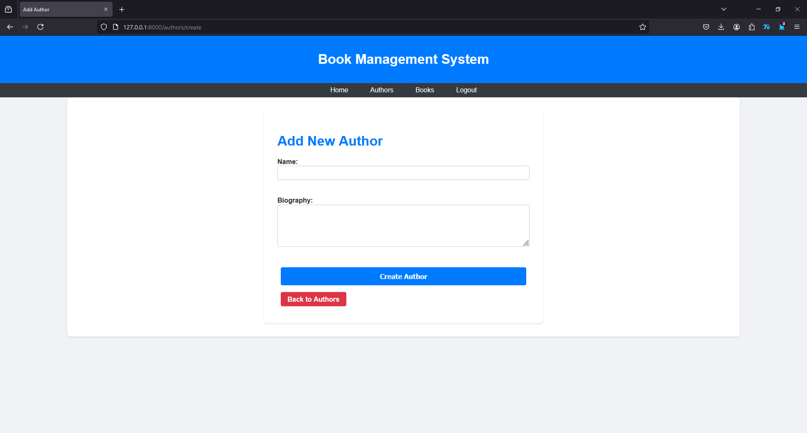

# Laravel CRUD Application

## Introduction
This project is a simple CRUD (Create, Read, Update, Delete) application built using Laravel, a popular PHP framework. The application allows users to manage authors and books, including the ability to create, edit, delete, and view details of each. It also implements basic authentication to restrict CRUD operations to logged-in users while allowing public access to view data.

## Features and Database Schema
The application features:
- **User Authentication**: Users must log in to create, update, or delete authors and books. Public users can only view the data.
- **Author Management**: Users can add new authors, view details, update information, and delete authors.
- **Book Management**: Users can add new books, view details, update information, and delete books. Each book is associated with an author.
- **Database Schema**:
  - **Authors Table**: Stores information about authors with columns `id`, `name`, and `biography`.
  - **Books Table**: Stores information about books with columns `id`, `title`, `author_id` (foreign key), and `summary`.

## Screenshots

## Incomplete Features
While the core functionality of the application has been implemented, I intended to add additional features such as advanced search functionality for books and authors, and more detailed analytics for user activity. Unfortunately, due to time constraints and prioritization of basic features, these additional aspects were not completed. 

## Thoughts on Laravel
Laravel has proven to be a powerful and flexible framework for developing web applications. Its built-in features, such as Eloquent ORM for database interactions and Blade templating engine, greatly simplify common tasks and enhance productivity. In future classes, covering more advanced topics like Laravel’s job queues, real-time events, or API development would be beneficial to deepen understanding and broaden the scope of Laravel’s capabilities.

